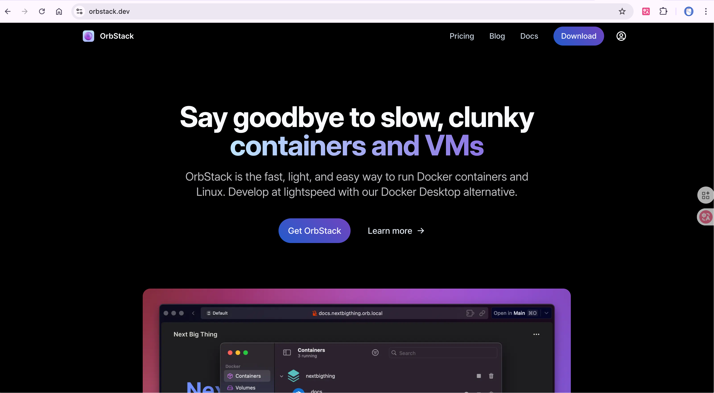
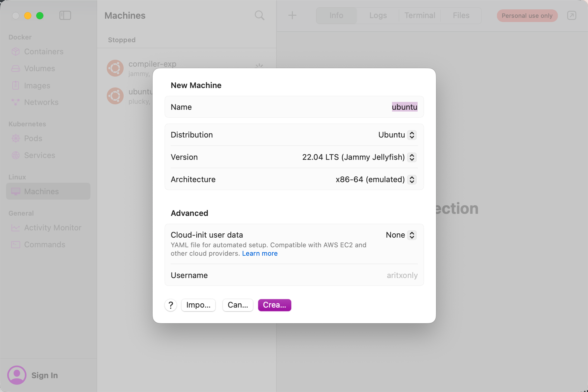
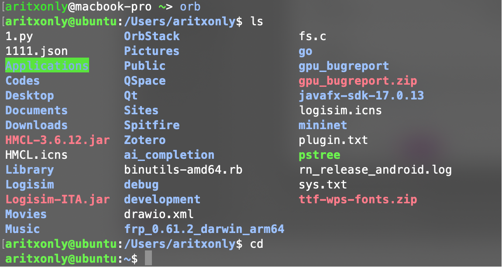
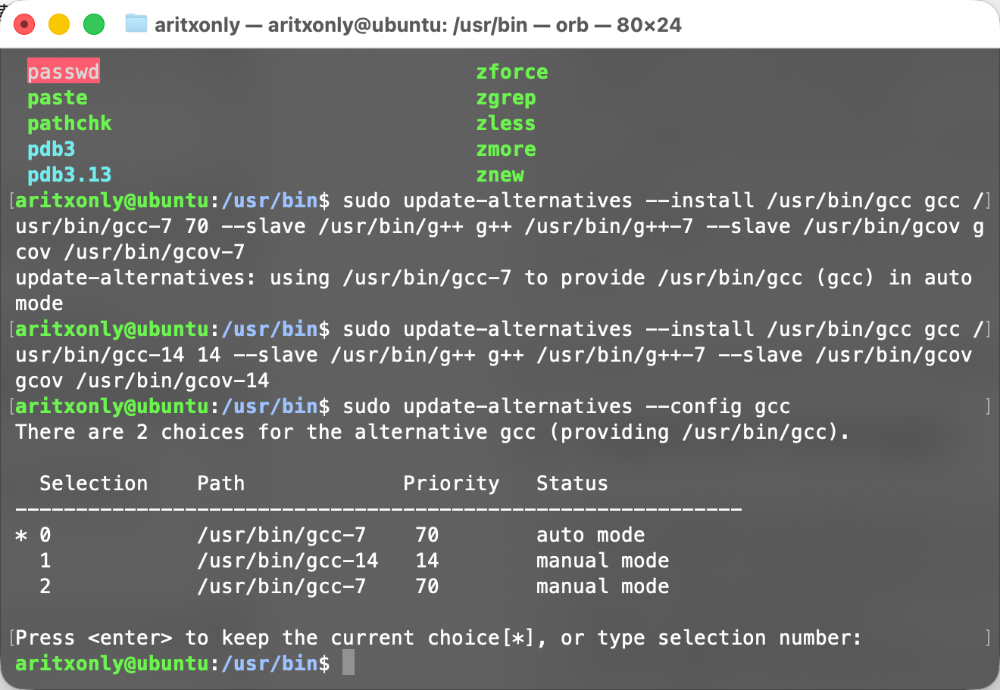

## 安装OrbStack

前往[官网](orbstack.dev)下载。安装后打开OrbStack。



## 创建OrbStack虚拟机

在Linux中点击Machines，点击右上角的➕号。选择Ubuntu，Version选择22.04/24.04（无所谓，因为后续都要装GCC-7），Architecture选择x86-64(emulated)。点击Create创建虚拟机。



在终端输入`orb start $你的虚拟机的名字`启动虚拟机。输入`orb`命令进入虚拟机。



## 配置实验环境

### 挂载工程文件夹到虚拟机

在虚拟机bash输入`cd`回到主目录。我们要建立主目录和macOS工程目录的链接。

以我自己的路径为例。我的macOS工程目录在`/Users/aritxonly/Codes/Compilers/exp`中，我想把`exp`文件夹挂载到虚拟机的`~/compiler`中，我只需要创建一个compiler文件夹，并简单输入：

```bash
sudo mount --bind /Users/aritxonly/Codes/Compilers/exp ~/compiler
```

**如果想持久化这个更改，每次开机时自动挂载，可以使用vim编辑`/etc/fstab`加上一行**

```
/Users/aritxonly/Codes/Compilers/exp  /home/aritxonly/compiler  none  bind  0  0
```

### 配置镜像源

除了实验手册上需要的NJU镜像源外，在Ubuntu22.04上还需要配置被归档的镜像源。否则，直接安装会报错：

```bash
E: Unable to locate package gcc-7
E: Package 'g++-7' has no installation candidate
```

在`/etc/apt/sources.list`中加入

```
# stable add by , in order to install g++7
deb [arch=amd64] http://archive.ubuntu.com/ubuntu focal main universe
```

### 安装GCC7

配置好镜像源后，输入`sudo apt update`和`sudo apt upgrade`更新软件包。随后就可以根据实验手册安装GCC-7

```bash
sudo apt install gcc-7 g++-7
```

在链接gcc-7到`gcc`之前，需要解链接原有的gcc-14

随后链接：

```bash
sudo ln -s /usr/bin/gcc-7 /usr/bin/gcc
```

建议在主目录创建shell脚本`link_gcc7.sh`并输入以下内容

```shell
#!/bin/bash
sudo ln -s /usr/bin/gcc-7 /usr/bin/gcc
if [ $? -eq 0 ]; then
    echo "Successfully linked"
else
    echo "Link failed: $?"
fi
```

输入`chmod +x link_gcc7.sh`后，每次进入虚拟机时运行即可。

**此外，更推荐的方法是：使用优先级配置**

```bash
sudo update-alternatives --install /usr/bin/gcc gcc /usr/bin/gcc-7 70 --slave /usr/bin/g++ g++ /usr/bin/g++-7 --slave /usr/bin/gcov gcov /usr/bin/gcov-7
sudo update-alternatives --install /usr/bin/gcc gcc /usr/bin/gcc-14 14 --slave /usr/bin/g++ g++ /usr/bin/g++-7 --slave /usr/bin/gcov gcov /usr/bin/gcov-14sudo update-alternatives --config gcc
```



输入`gcc -v`，若输出版本号为7.5，则gcc-7安装成功。

## 安装make

```bash
sudo apt install make
```

## 安装Flex与Bison

依次输入

```bash
sudo apt install flex
sudo apt install bison
```

即可安装。

Ubuntu22.04安装的bison可能为最新版本3.8.2，**如果需要与实验环境完全相同的版本，需要手动安装**。

首先卸载bison

```bash
sudo apt remove bison
```

随后在阿里云镜像站拉取对应版本的bison安装包

```bash
wget https://mirrors.aliyun.com/gnu/bison/bison-3.5.1.tar.xz
```

*如果提示缺少wget，运行`sudo apt install wget`即可*

安装xz-utils用于解压：

```bash
sudo apt install xz-utils
```

解压安装包：

```bash
tar -xvJf bison-3.5.1.tar.xz 
```

进入bison的解压目录并安装：（可能需要超级用户权限）

```bash
cd bison-3.5.1/
./configure && make && make install
```

## 其他需要做的准备

### 配置git与github代码托管

在工程目录输入

```bash
git init
```

并参考[这个教程](https://docs.github.com/zh/authentication/connecting-to-github-with-ssh/generating-a-new-ssh-key-and-adding-it-to-the-ssh-agent)配置Github代码托管所需的SSH key

### 配置VSCode/Cursor

**按照Remote ssh的操作进行安装配置**，对应的ssh命令是`ssh uname@orb`