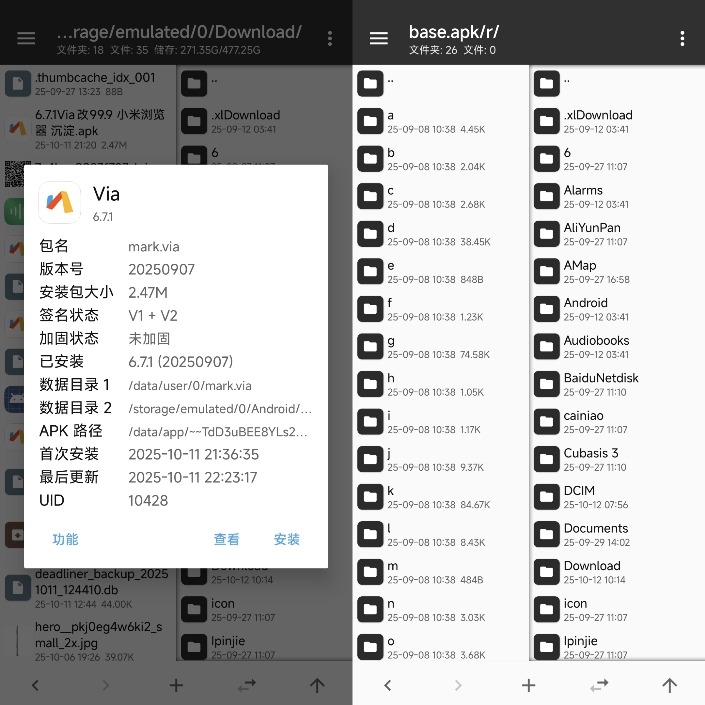
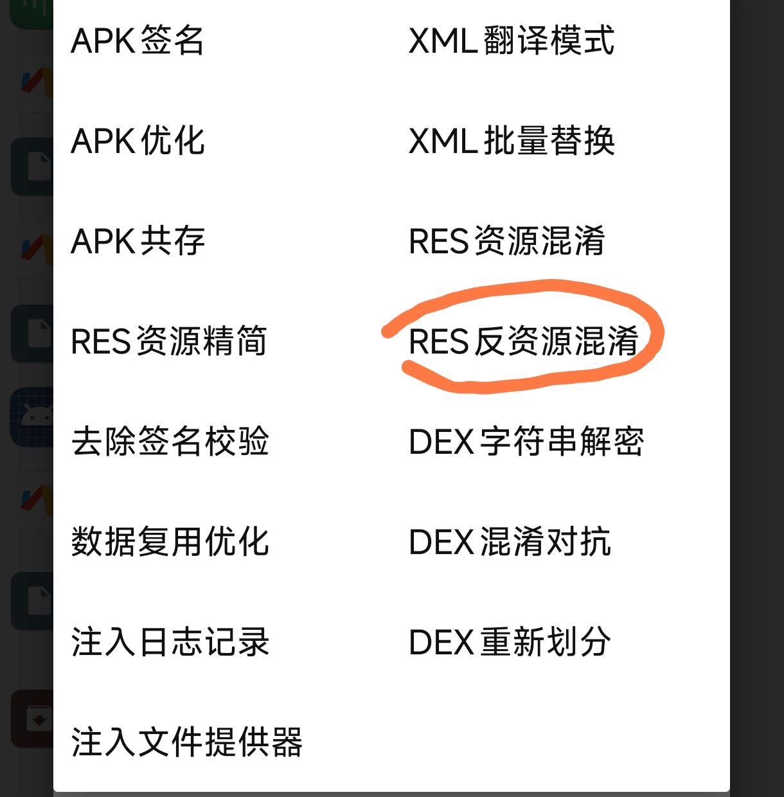
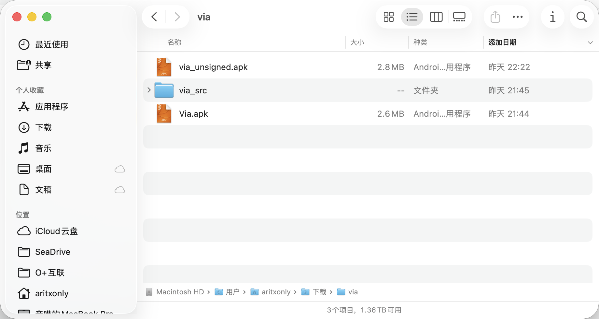
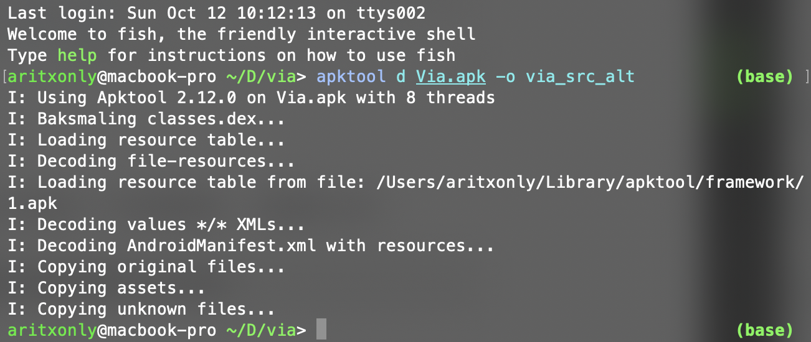
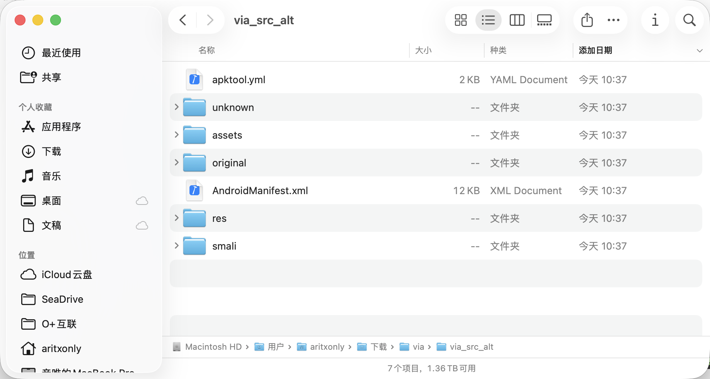
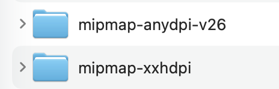
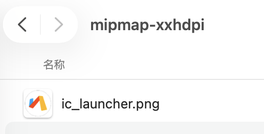
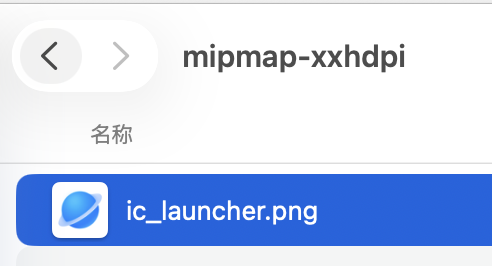
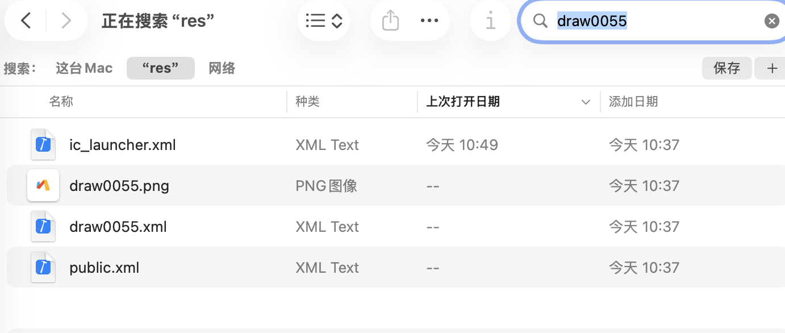
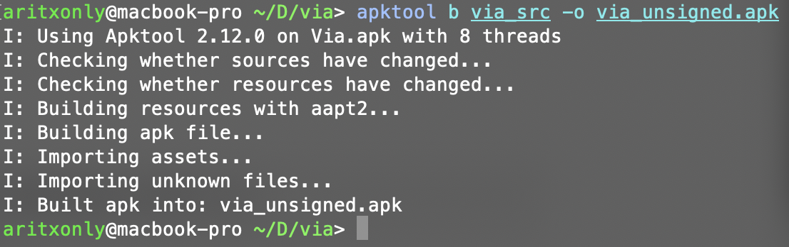

> [!IMPORTANT]
>
> 免责声明
>
> 本教程仅用于**个人学习、研究与界面美化**等**非商业性用途**。
>
>  Android 应用程序（APK）及其资源、代码、图标、签名文件均受开发者著作权及相关法律保护。
>
> - 任何形式的反编译、修改、再分发或重新上架，若未经版权持有人**明确书面授权**，可能违反著作权法、计算机软件保护条例、应用商店开发者政策及用户协议。
> - 若您仅在**本地设备上自用**，请勿以任何方式将修改后的应用进行公开传播、分享、销售或用于盈利目的。
> - 修改及重新签名操作可能破坏应用完整性与安全性，导致数据丢失、更新异常、或触发安全警告，请务必**自行承担风险**。
> - 建议在测试机或虚拟环境中操作，并保留原始 APK 与数据备份。
>
> **如用于第三方 APP（闭源项目）**，请务必确认开发者允许此类修改行为。若开发者未明确许可，请立即停止操作。

## 前置准备

在开始反编译修改app图标之前，**你需要有以下准备**：

- **脑子**：是的，首先要带上它。遇到问题先动脑，再搜索，再问 AI。不思考、不阅读、不查资料直接开问——本人一律不回答。
- **一定的安卓开发基础**：至少得知道 APK 是个什么东西，资源文件长什么样，res/ 文件夹里那些奇奇怪怪的名字（mipmap、drawable、values）是干啥的。不要求你会写 Java/Kotlin，但起码得看得懂 XML，知道签名、包名、图标在哪个目录。
- **一台电脑**：Windows、macOS、Linux 都行。能打开终端（或 PowerShell），能装 JDK，能用 apktool 命令。没电脑、只靠手机 Termux？行，但请自行折腾，后果自负。
- **需要替换的图标资源文件**：最好包含了正方形、透明背景的前景和正方形的背景。需要png格式或svg格式。
- **需要修改的apk文件与备份**：一定要进行备份！！！

在电脑上通过官网https://apktool.org/docs/install安装apktool并且将其在终端中配置好后，以我修改的Via浏览器的图标为例，让我们开始今天的教程。

## 提取apk

解包apk前，建议先通过MT管理器查看是否有资源混淆。点击提取的apk，点击查看，观察目录结构。如果内部是诸如`a`、`b`、`c`等看不出具体内容的apk，则代表它经过了资源混淆。

此时我们只需要点击apk，点击左下角的功能，使用res反资源混淆即可。

我们将反资源混淆的apk文件（通常为xxx_anti.apk）发送到电脑上。新建工程文件夹，把反资源混淆的apk放进去，开始解包。

## 解包apk

在工程文件夹打开终端/cmd（具体操作在这里不过多赘述，可以搜索网络），随后输入命令：

```bash
apktool d 你的apk名字.apk -o 存放反编译结果的文件夹名称
```

回车后，你会看到如下结果：

这时，进入我们刚刚生成的文件夹（我这里为`via_src_alt`），就可以看到apk反编译的结果了。

## 修改图标

图标文件一般位于名为`mipmap-*`的文件夹下方。对于Via，主要是这两个文件夹：

此时我们需要分情况讨论：

- mipmap中为`.png`格式的文件
- mipmap中为`.xml`格式的文件

### 处理`.png`格式图标

Via浏览器的`mipmap-xxhdpi`中的文件是`ic_launcher.png`，是一个png格式的图标。针对这个图标，我们只需要把准备好的合成的、不分层的png图标替换进去即可。

### 处理`.xml`格式图标

使用文本编辑器（记事本、VSCode、CotEditor都可以）打开`ic_launcher.xml`，分析分层自适应图标的结构。在Via中`mipmap-anydpi-v26/ic_launcher.xml`就是负责做这个的。

一个常见的分层图标文件如下：

```xml
<?xml version="1.0" encoding="utf-8"?>
<adaptive-icon
  xmlns:android="http://schemas.android.com/apk/res/android">
    <background android:drawable="@color/color0024" />
    <foreground android:drawable="@drawable/draw0055" />
    <monochrome android:drawable="@drawable/draw0056" />
</adaptive-icon>
```

其中，字段的作用分别如下：

- `<background>` 背景层：
这个决定了图标底色是什么。
它通常引用一个颜色资源，比如 `@color/color0024`，也可以是图片，比如 `@drawable/bg_launcher`。
在自适应图标中，背景会被系统遮罩成圆形或方形（取决于设备 Launcher），所以底色要够简洁，别放复杂纹理。

- `<foreground>` 前景层：
这就是你真正看到的图标主体，也就是你要替换的那张图。
一般是 `@drawable/` 下的一张 PNG、SVG 或 XML 图层（layer-list/vector）。
它会叠在背景上方，并遵守系统的“安全区”边界（默认四周留 20% 空白，避免裁切）。

- `<monochrome>` 单色图层（Android 13+ 特有）：
这是给 Android 13 及以上系统用的“单色主题图标”素材。也就是所说的莫奈图标。
当系统启用“主题图标”模式时，Launcher 会忽略彩色前景层，只渲染这个灰度图层。
如果没有这个字段，系统会自动灰化前景层。

在我的例子中，由于我想保留Via原本的白色背景，只把前景换成小米浏览器的图标，所以我只演示对`foreground`的修改，而不对`background`进行修改。这部分可以在AI的协助下完成，因此不用过多赘述。

我们可以看到，foreground引用的是名为`draw0055`的图标资源文件。我们用全局搜索在res文件夹中搜索`draw0055`：

可以看到同样有两个文件，一个透明底的`draw0055.png`、一个`xml`文件。和之前一样，png图片直接进入目录替换即可，注意透明底换透明底，我们把它换成小米浏览器的前景即可。而对于`draw0055.xml`文件，我们使用以下方式进行替换：

### 替换`.xml`格式资源

同样使用文本编辑器进行查看。我们看到Via浏览器中的`draw0055.xml`资源内部是类似这样的：

```xml
<?xml version="1.0" encoding="utf-8"?>
<vector android:height="108.0dip" android:width="108.0dip" android:viewportWidth="216.0" android:viewportHeight="216.0"
  xmlns:android="http://schemas.android.com/apk/res/android">
    <path android:fillColor="#ff00a5f6" android:pathData="..." />
    <path android:fillColor="#ffff3e00" android:pathData="..." />
    <path android:fillColor="#ffffb700" android:pathData="..." />
</vector>
```

这代表这个图标是由矢量图转化的xml文件。

如果你需要替换的图标本身就是svg格式，可以用Android Studio导入把它转化为xml矢量图。

**如果是png格式的图片，我们需要把这个xml引用到我们的位图资源。**

我们先将这个文件中的内容替换成这样：

```xml
<?xml version="1.0" encoding="utf-8"?>
<layer-list xmlns:android="http://schemas.android.com/apk/res/android">
    <item>
        <inset
            android:drawable="@drawable/mi_icon"
            android:inset="0dp" />
    </item>
</layer-list>
```

这里，我自定义的资源叫做`mi_icon`，你可以把它叫做任意名字，并把你要替换的图标命名成 `这个名字.png` 放在`drawable-nodpi`文件夹中（如果没有则新建）。`android:inset`后面的值你可以自行修改，我推荐你先安装后进行回编译看看效果再进行修改。

## 回编译

在终端中输入

```bash
apktool b 刚刚修改的文件夹名称 -o 回编译后的apk名称.apk
```



随后用MT管理器或者任何你喜欢的方式对这个apk进行签名，安装，大功告成。